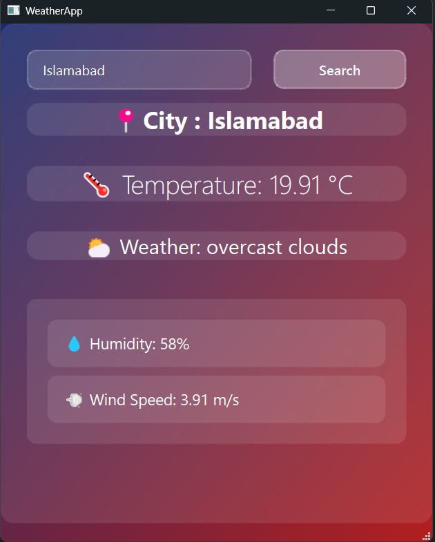

# 🌦️ Qt Weather App

A modern, minimalistic weather application built using **C++ and Qt** (QtWidgets), developed as part of my Object-Oriented Programming (OOP) course project.

It fetches real-time weather data from the **OpenWeatherMap API** and displays it in a simple yet elegant UI with support for **automatic location detection** using IP.

---

## 🚀 Features

- 📍 Auto-detect location on startup
- 🔍 Search weather by city name
- 🌡️ Displays temperature, humidity, weather description, and wind speed
- 🌐 Real-time data from OpenWeatherMap API
- 🎨 Clean, responsive GUI using Qt Designer

---

## 📷 Demo

 
*This is a quick screenShot of the app in action.*

---

## 🛠️ Tech Stack

- **C++**
- **Qt Framework (QtWidgets, QtNetwork)**
- **OpenWeatherMap API**
- **IP-API for location detection**

---
Coded by Muhammad Israr
LinkedIn: www.linkedin.com/in/muhammad-israr-01364a321

## 📁 How to Run

1. Clone the repository:
   ```bash
   git clone https://github.com/israrkhan-cys/WeatherApp_OOP_Project
   cd WeatherApp_OOP_Project
